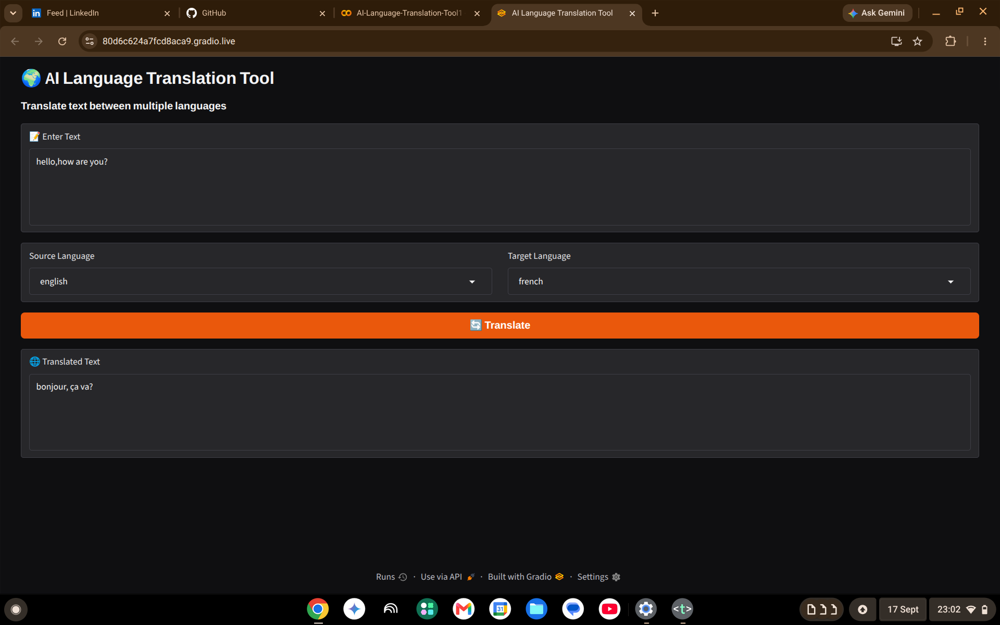

# 🌍 AI Language Translation Tool

An AI-powered language translation application built using Python and Gradio. It allows users to enter text, select source and target languages, and translate the text through an interactive interface.

## ✨ Features

- 🌐 Multi-language translation
- 📝 Text input
- 🔄 Source and target language selection
- 🤖 Automated translation
- 💻 Interactive Gradio interface
- 🗑️ Easy-to-use interface

## 🌎 Supported Languages

- English
- French
- Spanish
- German
- Italian
- Hindi
- Telugu



## 🛠️ Technologies Used

- Python
- Gradio
- Deep Translator
- MyMemory Translation Service
## 📂 Project Structure

```text
AI-Language-Translation-Tool/
│
├── app.py
├── requirements.txt
├── README.md
└── translation-tool-demo.png
